# Enterprise CI/CD Pipeline Transformation Guide

## Current State vs Enterprise Requirements

### **Current Setup (Good for Small-Medium Teams)**
- ✅ Basic CI/CD with GitHub Actions
- ✅ Docker containerization
- ✅ Secret management via GitHub Secrets
- ✅ Single environment deployment (production)
- ✅ Manual approval for deployments
- ✅ Basic health checks

### **Enterprise Requirements**
- 🏢 **Multi-environment pipelines** (dev/staging/prod/dr)
- 🏢 **Advanced security scanning** (SAST/DAST/SCA/container scanning)
- 🏢 **Compliance & governance** (SOX, GDPR, HIPAA, etc.)
- 🏢 **Advanced monitoring & observability**
- 🏢 **Infrastructure as Code** (IaC)
- 🏢 **Policy as Code** (PaC)
- 🏢 **Advanced testing strategies**
- 🏢 **Disaster recovery & business continuity**
- 🏢 **Audit trails & compliance reporting**
- 🏢 **Advanced secret management**

---

## 🏗️ Enterprise CI/CD Architecture

### **1. Multi-Environment Pipeline Strategy**

```mermaid
graph LR
    A[Developer] --> B[Feature Branch]
    B --> C[PR/MR]
    C --> D[Dev Environment]
    D --> E[Integration Tests]
    E --> F[Staging Environment]
    F --> G[UAT/Performance Tests]
    G --> H[Security Scans]
    H --> I[Production Deployment]
    I --> J[Canary/Blue-Green]
    J --> K[Full Production]
    K --> L[DR Environment]
```



**Implementation:**
- **Development**: Automatic deployment on feature branch push
- **Staging**: Automatic deployment on main branch merge
- **Production**: Manual approval with automated rollback
- **DR**: Synchronized replica for disaster recovery

### **2. Advanced Security Integration**

#### **Static Application Security Testing (SAST)**
```yaml
# .github/workflows/security-sast.yml
name: SAST Security Scan
on: [push, pull_request]

jobs:
  sast:
    runs-on: ubuntu-latest
    steps:
      - uses: actions/checkout@v4
      
      # CodeQL Analysis
      - name: Initialize CodeQL
        uses: github/codeql-action/init@v3
        with:
          languages: python
          
      - name: Perform CodeQL Analysis
        uses: github/codeql-action/analyze@v3
        
      # SonarQube Integration
      - name: SonarQube Scan
        uses: sonarqube-quality-gate-action@master
        env:
          SONAR_TOKEN: ${{ secrets.SONAR_TOKEN }}
          
      # Semgrep Security Scan
      - name: Semgrep
        uses: returntocorp/semgrep-action@v1
        with:
          config: >-
            p/security-audit
            p/secrets
            p/owasp-top-ten
```

#### **Dynamic Application Security Testing (DAST)**
```yaml
# .github/workflows/security-dast.yml
name: DAST Security Scan
on:
  workflow_run:
    workflows: ["Deploy to Staging"]
    types: [completed]

jobs:
  dast:
    runs-on: ubuntu-latest
    steps:
      - name: OWASP ZAP Scan
        uses: zaproxy/action-full-scan@v0.8.0
        with:
          target: 'https://staging.yourapp.com'
          rules_file_name: '.zap/rules.tsv'
          cmd_options: '-a'
```

#### **Container Security Scanning**
```yaml
# .github/workflows/container-security.yml
name: Container Security
on: [push]

jobs:
  container-scan:
    runs-on: ubuntu-latest
    steps:
      - uses: actions/checkout@v4
      
      # Trivy vulnerability scanner
      - name: Run Trivy vulnerability scanner
        uses: aquasecurity/trivy-action@master
        with:
          image-ref: 'your-registry/your-app:${{ github.sha }}'
          format: 'sarif'
          output: 'trivy-results.sarif'
          
      # Snyk container scanning
      - name: Snyk Container
        uses: snyk/actions/docker@master
        env:
          SNYK_TOKEN: ${{ secrets.SNYK_TOKEN }}
        with:
          image: your-registry/your-app:${{ github.sha }}
          args: --severity-threshold=high
```

### **3. Infrastructure as Code (IaC)**

#### **Terraform Enterprise Setup**
```hcl
# terraform/environments/production/main.tf
terraform {
  required_version = ">= 1.0"
  
  backend "remote" {
    organization = "your-org"
    workspaces {
      name = "fastapi-production"
    }
  }
  
  required_providers {
    aws = {
      source  = "hashicorp/aws"
      version = "~> 5.0"
    }
    kubernetes = {
      source  = "hashicorp/kubernetes"
      version = "~> 2.0"
    }
  }
}

# EKS Cluster
module "eks" {
  source = "../../modules/eks"
  
  cluster_name    = "fastapi-prod"
  cluster_version = "1.28"
  
  vpc_id     = module.vpc.vpc_id
  subnet_ids = module.vpc.private_subnets
  
  node_groups = {
    main = {
      desired_capacity = 3
      max_capacity     = 10
      min_capacity     = 1
      instance_types   = ["t3.medium"]
    }
  }
  
  tags = local.common_tags
}

# Application Load Balancer
module "alb" {
  source = "../../modules/alb"
  
  name               = "fastapi-prod-alb"
  vpc_id            = module.vpc.vpc_id
  subnets           = module.vpc.public_subnets
  security_groups   = [module.security_groups.alb_sg_id]
  
  certificate_arn = module.acm.certificate_arn
  
  tags = local.common_tags
}
```

#### **Kubernetes Manifests with GitOps**
```yaml
# k8s/production/deployment.yaml
apiVersion: apps/v1
kind: Deployment
metadata:
  name: fastapi-app
  namespace: production
  labels:
    app: fastapi
    version: v1
spec:
  replicas: 3
  strategy:
    type: RollingUpdate
    rollingUpdate:
      maxSurge: 1
      maxUnavailable: 0
  selector:
    matchLabels:
      app: fastapi
  template:
    metadata:
      labels:
        app: fastapi
        version: v1
      annotations:
        prometheus.io/scrape: "true"
        prometheus.io/port: "9000"
    spec:
      serviceAccountName: fastapi-sa
      securityContext:
        runAsNonRoot: true
        runAsUser: 1000
        fsGroup: 2000
      containers:
      - name: fastapi
        image: your-registry/fastapi:${IMAGE_TAG}
        ports:
        - containerPort: 9000
          name: http
        env:
        - name: DD_ENV
          value: "production"
        - name: DD_SERVICE
          value: "fastapi"
        - name: DD_VERSION
          value: "${IMAGE_TAG}"
        envFrom:
        - secretRef:
            name: fastapi-secrets
        - configMapRef:
            name: fastapi-config
        resources:
          requests:
            memory: "256Mi"
            cpu: "250m"
          limits:
            memory: "512Mi"
            cpu: "500m"
        livenessProbe:
          httpGet:
            path: /health
            port: 9000
          initialDelaySeconds: 30
          periodSeconds: 10
        readinessProbe:
          httpGet:
            path: /ready
            port: 9000
          initialDelaySeconds: 5
          periodSeconds: 5
        securityContext:
          allowPrivilegeEscalation: false
          readOnlyRootFilesystem: true
          capabilities:
            drop:
            - ALL
```

### **4. Policy as Code (PaC)**

#### **Open Policy Agent (OPA) Policies**
```rego
# policies/security/required-labels.rego
package kubernetes.admission

deny[msg] {
    input.request.kind.kind == "Deployment"
    required_labels := {"app", "version", "environment"}
    provided_labels := input.request.object.metadata.labels
    missing := required_labels - object.keys(provided_labels)
    count(missing) > 0
    msg := sprintf("Missing required labels: %v", [missing])
}

deny[msg] {
    input.request.kind.kind == "Deployment"
    input.request.object.spec.template.spec.securityContext.runAsRoot == true
    msg := "Containers must not run as root"
}
```

#### **Terraform Sentinel Policies**
```hcl
# policies/terraform/aws-security.sentinel
import "tfplan/v2" as tfplan

# Ensure all S3 buckets have encryption enabled
main = rule {
    all tfplan.resource_changes as _, changes {
        changes.type is "aws_s3_bucket" and
        changes.change.after.server_side_encryption_configuration is not null
    }
}
```

### **5. Advanced Testing Strategy**

#### **Comprehensive Test Pipeline**
```yaml
# .github/workflows/comprehensive-testing.yml
name: Comprehensive Testing
on: [push, pull_request]

jobs:
  unit-tests:
    runs-on: ubuntu-latest
    steps:
      - uses: actions/checkout@v4
      - name: Setup Python
        uses: actions/setup-python@v4
        with:
          python-version: '3.12'
      - name: Install dependencies
        run: |
          pip install -r requirements.txt
          pip install -r requirements-test.txt
      - name: Run unit tests
        run: |
          pytest tests/unit/ --cov=src --cov-report=xml --junitxml=junit.xml
      - name: Upload coverage
        uses: codecov/codecov-action@v3

  integration-tests:
    runs-on: ubuntu-latest
    services:
      postgres:
        image: postgres:15
        env:
          POSTGRES_PASSWORD: test
        options: >-
          --health-cmd pg_isready
          --health-interval 10s
          --health-timeout 5s
          --health-retries 5
    steps:
      - uses: actions/checkout@v4
      - name: Run integration tests
        run: pytest tests/integration/

  contract-tests:
    runs-on: ubuntu-latest
    steps:
      - uses: actions/checkout@v4
      - name: Pact Contract Testing
        run: |
          pytest tests/contract/
          pact-broker publish pacts/ --consumer-app-version=${{ github.sha }}

  performance-tests:
    runs-on: ubuntu-latest
    steps:
      - uses: actions/checkout@v4
      - name: K6 Performance Tests
        uses: grafana/k6-action@v0.3.0
        with:
          filename: tests/performance/load-test.js
          flags: --out influxdb=http://influxdb:8086/k6

  chaos-engineering:
    runs-on: ubuntu-latest
    if: github.ref == 'refs/heads/main'
    steps:
      - name: Chaos Monkey
        run: |
          # Litmus chaos engineering tests
          kubectl apply -f chaos-experiments/
```

### **6. Advanced Monitoring & Observability**

#### **Comprehensive Monitoring Stack**
```yaml
# monitoring/prometheus/values.yaml
prometheus:
  prometheusSpec:
    retention: 30d
    storageSpec:
      volumeClaimTemplate:
        spec:
          storageClassName: gp3
          accessModes: ["ReadWriteOnce"]
          resources:
            requests:
              storage: 100Gi

grafana:
  adminPassword: ${GRAFANA_ADMIN_PASSWORD}
  dashboardProviders:
    dashboardproviders.yaml:
      apiVersion: 1
      providers:
      - name: 'default'
        orgId: 1
        folder: ''
        type: file
        disableDeletion: false
        editable: true
        options:
          path: /var/lib/grafana/dashboards/default

alertmanager:
  config:
    global:
      slack_api_url: ${SLACK_WEBHOOK_URL}
    route:
      group_by: ['alertname']
      group_wait: 10s
      group_interval: 10s
      repeat_interval: 1h
      receiver: 'web.hook'
    receivers:
    - name: 'web.hook'
      slack_configs:
      - channel: '#alerts'
        title: 'Alert: {{ .GroupLabels.alertname }}'
        text: '{{ range .Alerts }}{{ .Annotations.summary }}{{ end }}'
```

### **7. Enterprise Secret Management**

#### **HashiCorp Vault Integration**
```yaml
# .github/workflows/vault-secrets.yml
name: Deploy with Vault Secrets
on:
  push:
    branches: [main]

jobs:
  deploy:
    runs-on: ubuntu-latest
    steps:
      - uses: actions/checkout@v4
      
      - name: Import Secrets from Vault
        uses: hashicorp/vault-action@v2
        with:
          url: https://vault.company.com
          method: jwt
          role: github-actions
          secrets: |
            secret/data/fastapi/production database_url | DATABASE_URL ;
            secret/data/fastapi/production api_keys | API_KEYS ;
            secret/data/fastapi/production certificates | TLS_CERT
            
      - name: Deploy with secrets
        run: |
          # Deploy using imported secrets
          helm upgrade --install fastapi ./helm-chart \
            --set database.url="$DATABASE_URL" \
            --set api.keys="$API_KEYS"
```

### **8. Compliance & Governance**

#### **Automated Compliance Scanning**
```yaml
# .github/workflows/compliance.yml
name: Compliance Scanning
on: [push, pull_request]

jobs:
  compliance:
    runs-on: ubuntu-latest
    steps:
      - uses: actions/checkout@v4
      
      # CIS Benchmark scanning
      - name: CIS Docker Benchmark
        run: |
          docker run --rm -v /var/run/docker.sock:/var/run/docker.sock \
            -v $(pwd):/host aquasec/docker-bench-security
            
      # NIST compliance check
      - name: NIST Compliance
        uses: aquasecurity/trivy-action@master
        with:
          scan-type: 'config'
          scan-ref: '.'
          format: 'json'
          output: 'nist-compliance.json'
          
      # Generate compliance report
      - name: Generate Compliance Report
        run: |
          python scripts/generate-compliance-report.py \
            --nist nist-compliance.json \
            --output compliance-report.html
```

### **9. Disaster Recovery & Business Continuity**

#### **Multi-Region Deployment**
```hcl
# terraform/disaster-recovery/main.tf
module "primary_region" {
  source = "../modules/application"
  
  region = "us-east-1"
  environment = "production"
  is_primary = true
  
  database_backup_retention = 30
  cross_region_backup = true
  backup_destination_region = "us-west-2"
}

module "dr_region" {
  source = "../modules/application"
  
  region = "us-west-2"
  environment = "production-dr"
  is_primary = false
  
  # Standby configuration
  database_replica_source = module.primary_region.database_identifier
  auto_failover_enabled = true
}
```

### **10. Advanced CI/CD Orchestration**

#### **GitOps with ArgoCD**
```yaml
# argocd/applications/fastapi-production.yaml
apiVersion: argoproj.io/v1alpha1
kind: Application
metadata:
  name: fastapi-production
  namespace: argocd
spec:
  project: default
  source:
    repoURL: https://github.com/your-org/fastapi-k8s-manifests
    targetRevision: main
    path: production
  destination:
    server: https://kubernetes.default.svc
    namespace: production
  syncPolicy:
    automated:
      prune: true
      selfHeal: true
    syncOptions:
    - CreateNamespace=true
    retry:
      limit: 5
      backoff:
        duration: 5s
        factor: 2
        maxDuration: 3m
```

---

## 🏢 Enterprise Tools & Platforms

### **CI/CD Platforms**
- **Jenkins X**: Kubernetes-native CI/CD
- **Tekton**: Cloud-native CI/CD building blocks
- **Spinnaker**: Multi-cloud continuous delivery
- **GitLab Ultimate**: Enterprise DevOps platform
- **Azure DevOps**: Microsoft's enterprise solution

### **Security Tools**
- **Snyk**: Vulnerability management
- **Checkmarx**: SAST/DAST scanning
- **Aqua Security**: Container security platform
- **Twistlock/Prisma Cloud**: Cloud security
- **Veracode**: Application security testing

### **Monitoring & Observability**
- **Datadog**: Full-stack monitoring
- **New Relic**: Application performance monitoring
- **Splunk**: Log management and analytics
- **Elastic Stack**: Search and analytics
- **Dynatrace**: AI-powered monitoring

### **Secret Management**
- **HashiCorp Vault**: Enterprise secret management
- **AWS Secrets Manager**: Cloud-native secrets
- **Azure Key Vault**: Microsoft's secret store
- **CyberArk**: Enterprise privileged access

### **Governance & Compliance**
- **Open Policy Agent**: Policy as code
- **Falco**: Runtime security monitoring
- **Gatekeeper**: Kubernetes policy enforcement
- **Terraform Sentinel**: Infrastructure policy
- **Chef InSpec**: Compliance automation

---

## 🚀 Migration Path: Current → Enterprise

### **Phase 1: Foundation (Months 1-2)**
1. ✅ Implement multi-environment strategy
2. ✅ Add comprehensive testing pipeline
3. ✅ Integrate basic security scanning
4. ✅ Set up infrastructure as code

### **Phase 2: Security & Compliance (Months 3-4)**
1. ✅ Implement SAST/DAST scanning
2. ✅ Add policy as code framework
3. ✅ Integrate enterprise secret management
4. ✅ Set up compliance monitoring

### **Phase 3: Advanced Operations (Months 5-6)**
1. ✅ Deploy comprehensive monitoring
2. ✅ Implement GitOps workflows
3. ✅ Add chaos engineering
4. ✅ Set up disaster recovery

### **Phase 4: Optimization (Ongoing)**
1. ✅ Performance optimization
2. ✅ Cost optimization
3. ✅ Process automation
4. ✅ Team training and adoption

---

## 💰 Cost Considerations

### **Tool Licensing**
- **Enterprise CI/CD platforms**: $50-200/user/month
- **Security scanning tools**: $10-50/developer/month
- **Monitoring platforms**: $15-100/host/month
- **Secret management**: $5-20/secret/month

### **Infrastructure**
- **Multi-region deployment**: 2-3x infrastructure costs
- **High availability**: 1.5-2x compute costs
- **Backup and DR**: 20-50% additional storage costs
- **Compliance tooling**: $10-50k/year for enterprise tools

### **Personnel**
- **DevOps engineers**: $120-200k/year
- **Security engineers**: $130-220k/year
- **SRE specialists**: $140-250k/year
- **Compliance specialists**: $100-180k/year

---

## 📊 ROI & Business Value

### **Quantifiable Benefits**
- **Deployment frequency**: 10-100x increase
- **Lead time**: 50-90% reduction
- **MTTR**: 60-80% reduction
- **Security incidents**: 70-90% reduction
- **Compliance audit time**: 80-95% reduction

### **Business Impact**
- **Faster time to market**: Competitive advantage
- **Reduced operational costs**: Automation efficiency
- **Improved reliability**: Better customer experience
- **Risk mitigation**: Reduced security and compliance risks
- **Developer productivity**: Focus on features, not operations

---

This enterprise transformation represents a significant investment but provides the foundation for scalable, secure, and compliant software delivery at enterprise scale. 